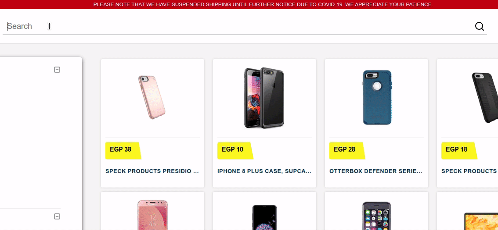

<h1 align="center">
🔍 Autocomplete with MERN Stack and Elasticsearch
</h1>
<p align="center">
Elasticsearch, MongoDB, Expressjs, React/Redux, Nodejs
</p>

<br>



<br>

# Installing the app


# Start server

```terminal
$ cd server
```

#### Linux host only: Set vm.max_map_count to at least 262144

```terminal
$  sudo sysctl -w vm.max_map_count=262144
```

#### Run docker-compose to bring up the elasticsearch cluster in detached mode

```terminal
$  docker-compose up -d
```

#### Run Nodejs server

```terminal
$ npm install
$ npm run dev
```

# Start client

```terminal
$ cd client
$ npm install
$ npm start
```

## Prerequirements
- [Node](https://nodejs.org/en/download/) ^10.0.0
- [npm](https://nodejs.org/en/download/package-manager/)
